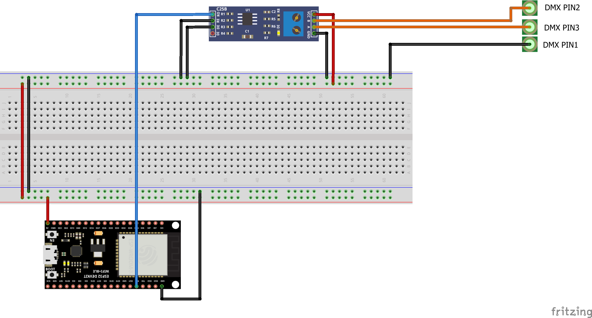

# ESP32-DMX-To-Serial

Read data with the ESP32 from DMX and send it with the serial interface to USB

# Circuit diagram

# Data format

After a successful DMX connection has been established, the DMX data is continuously sent to the serial control center.
All DMX channels are output in the following format `*<data>,<data>,<data>,...,<data>%.`
 
Example: `*0,0,20,255,0,...,50%`
